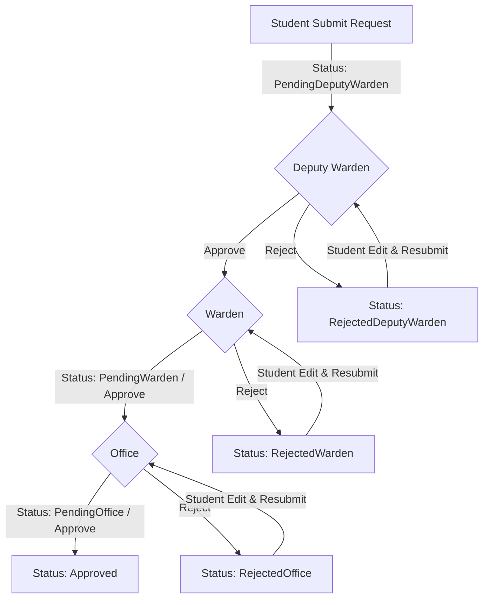

# Hostel Staff Mess Reduction Approval Workflow

This document describes the mess reduction request lifecycle and approval workflow for the hostel staff roles (Deputy Warden, Warden, and Office).

---

## 1. Workflow Architecture & States

The mess reduction approval process follows a strict sequential pipeline with three levels of authority:

---

## 2. Approval Levels & Staff Roles

### Level 1: Deputy Warden
- **Entry State**: `PendingDeputyWarden`
- **Assignment**: Forms are automatically assigned to specific Deputy Wardens based on the student's **Gender** and **Year of Study**.
- **Actions**:
  - **Approve**: Advances the request status to `PendingWarden`.
  - **Reject**: Moves the request status to `RejectedDeputyWarden`. Requires entering a rejection reason.
  - **Auto-Accept**: Deputy Wardens can define a date range (From Date to To Date) where requests are automatically accepted (`AUTO_ACCEPT` event type) and advanced to `PendingWarden` immediately upon submission.

### Level 2: Warden
- **Entry State**: `PendingWarden`
- **Assignment**: Incoming approved requests from Deputy Wardens.
- **Actions**:
  - **Approve**: Advances request status to `PendingOffice`.
  - **Reject**: Moves request status to `RejectedWarden`. Requires entering a rejection reason.
  - **Auto-Accept**: Wardens can also define a date range for auto-accepting requests, advancing them directly to `PendingOffice`.

### Level 3: Office
- **Entry State**: `PendingOffice`
- **Assignment**: Final approval stage before the request is marked as fully approved.
- **Actions**:
  - **Approve**: Marks request as `Approved`. The student's mess fee reduction count is officially locked.
  - **Reject**: Moves request status to `RejectedOffice`. Requires entering a rejection reason.

---

## 3. Form Resubmission Rules

When a request is rejected by any staff member, the student has the ability to modify the dates/details and resubmit:
- If rejected by **Deputy Warden** $\rightarrow$ Resubmits to **Deputy Warden** (`PendingDeputyWarden`).
- If rejected by **Warden** $\rightarrow$ Resubmits directly back to **Warden** (`PendingWarden`), bypassing the Deputy Warden stage to save time.
- If rejected by **Office** $\rightarrow$ Resubmits directly back to **Office** (`PendingOffice`).

---

## 4. Notifications & Audit Logs
- **System Activity Log**: Every state transition (automatic or manual) writes an entry into the activity logs with details about who performed the action, the previous state, the new state, and comments.
- **Student Notifications**: Push/email notifications are dispatched to students whenever a stage is approved or rejected.
- **Staff Notifications**: Incoming pending counts are dynamically updated on staff dashboards to ensure quick processing times.
